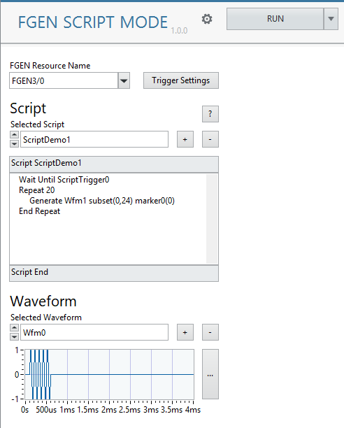
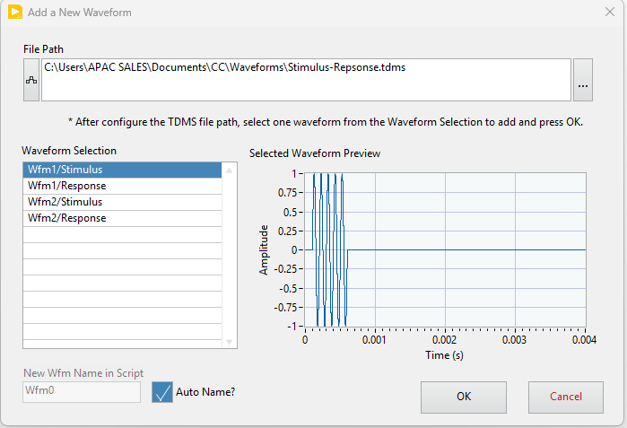
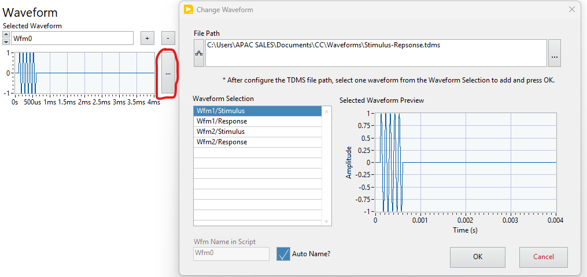
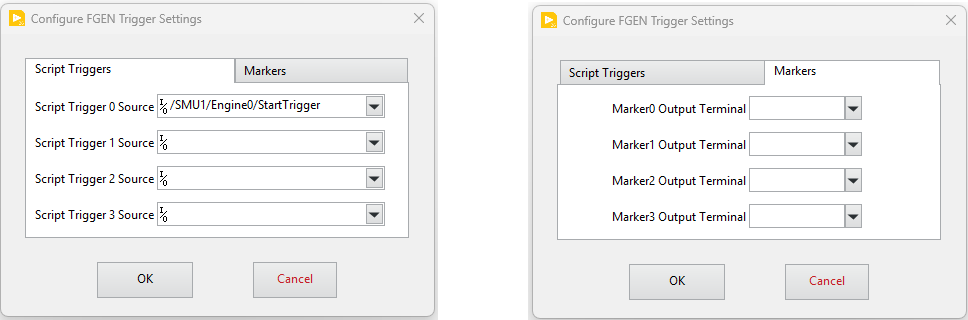
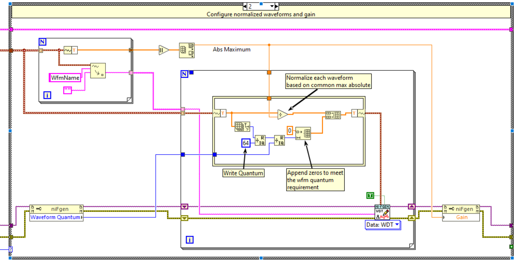

# NI FGEN Script Mode Plugin
## Overview

This InstrumentStudio measurement plugin runs the NI FGEN in the [script mode](https://www.ni.com/docs/en-US/bundle/ni-fgen/page/script-mode.html).  A script is a series of instructions that indicates how waveforms saved in the onboard memory should be outputed. To learn more about all the script instructions, please find out [here](https://www.ni.com/docs/en-US/bundle/ni-rfsg/page/scripting-instructions.html).

This plugin supports only a single channel instrument session. The supported waveform file format is TDMS. If you have other waveform saved in other file format, use the [NI DIAdem](https://www.ni.com/en/shop/data-acquisition-and-control/application-software-for-data-acquisition-and-control-category/what-is-diadem.html) or the [TDMS Waveform Creator Plugin](https://github.com/NI-Measurement-Plug-Ins/Tdms-Wfm-Creator-Plugin) to save it as TDMS file. 

## How To Use
### Script Section
In the Script section, click the **+**  (Add Script) button to add new script. The script name must be 

- Alphnumeric and no space between 
- Not allowed to start with number
- Not conflict with the Script Instructions
- Unique name from other added script name

After that, you can start to type script in the script body. If you have internet access, click the **?** (Documentation) button to see [some common use cases of script examples](https://www.ni.com/docs/en-US/bundle/ni-rfsg/page/common-scripting-use-cases.html).

The **Selected Script** combo box allows you to view and edit the added script. When run, only the **current selected script will be loaded and run**. 

Press the **-** button to remove the selected script.

### Waveform Section
In the Waveform section, click the **+** (Add Wavefrom) button to add a new waveform. After selected the TDMS file, select one of the **Waveform Selection** listed on the left. You can let the **Auto Name* be or give a unique name that does not clash with any exisitng added waveforms. Waveform naming format same as the script name requirement.  

The **Selected Waveform** allows you to preview the added waveform at below, and change it later by clicking the **...** button next to it:

Press the **-** button to remove the selected waveform.

### Trigger Settings
Click the **Trigger Settings** button to configure the **Script Trigger** source terminal and the **Marker Events** output terminals.

**Script Trigger** allows the execution of a script to wait for a codition met before going to next line. You must specify the source in order to make it work. 

**Marker Events** allows you to send a trigger to other instruments or device based on the exact sample point of a waveform. If you are using NI PXI instruments, likely you can use the implicit trigger naming like **"FGEN1/0/Marker0Event"** on these instruments to arm the Marker0-3 events. With that, there is no need to configure it to export on FGEN. But if you want to send trigger through physical channel of FGEN or controller, please specify it here. 

### Waveform Normalization and Resampling
The plugin will normalize the waveforms to +/- 1 first and then use the **Gain** setting to re-adjust to original amplitude in the TDMS source file. See the following LabVIEW code below:

The dt of each waveform is also used as sampling rate reference when calling the [niFgen Write Named Waveform (WDT)](https://www.ni.com/docs/en-US/bundle/ni-fgen-labview-api-ref/page/instr-lib/nifgen/nifgen-llb/nifgen-write-named-waveform-wdt-vi.html) function. 

## Hardware Dependencies

Not all NI FGEN models support script mode and types of script instruction. Check the features supported documentation [here](https://www.ni.com/docs/en-US/bundle/ni-fgen/page/devices.html).

## Software Dependencies

- InstrumentStudio Pro (2025 Q4 or higher)
- NI-FGEN (2025 Q4 or higher)
- LabVIEW (2025 Q3 or higher)

